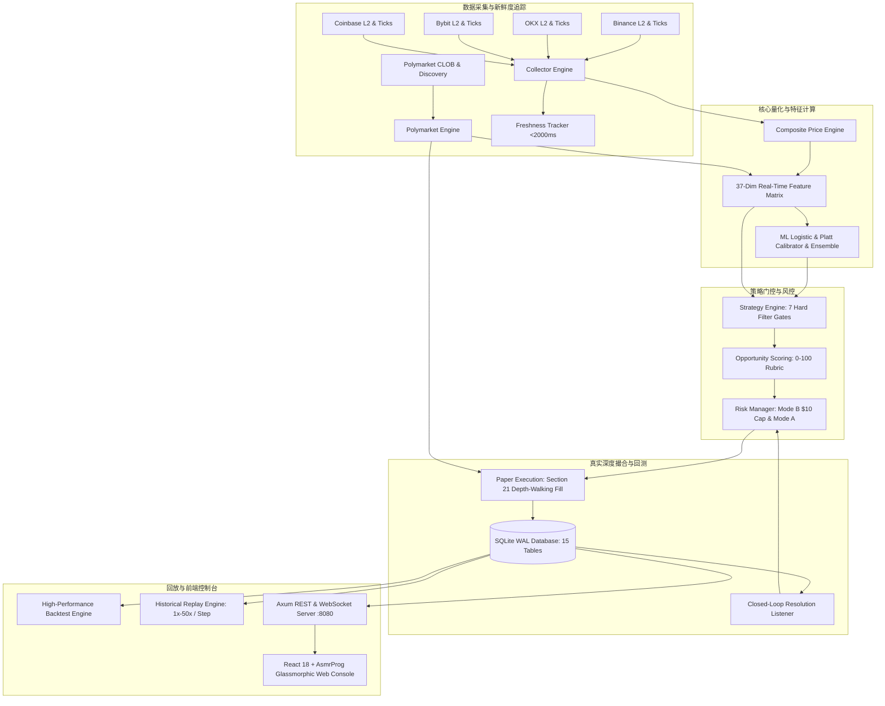

# EventAlpha - Polymarket 5-Minute Crypto Up/Down Quant System
### 工业级高精度量化预测、概率校准、真实深度模拟撮合与逐帧回放系统


-purple)
-success)


---

## 🌟 核心亮点与系统定位

**EventAlpha** 是一套专为 **Polymarket** 上的 **BTC / ETH / SOL 5 分钟 Up/Down 二元期权预测市场** 打造的工业级量化策略研究、实时预测与真实盘口深度模拟撮合系统。

系统坚决摒弃“玩具 Demo”与过度简化的假设，全链路遵循高频量化与预测市场微观结构规范，以 **“真实可运行、数据零泄漏、严格时间箭头、真实盘口撮合、长期可持续验证”** 为最高准则。

### 🛡️ 核心安全铁律（Zero Real Money Risk Invariant）
1. **内核级禁止实盘**：系统底层 `SafetyGuard` 在启动最前置阶段执行硬断言，配置 `real_trading_enabled` 必须恒为 `false`。任何试图开启实盘的配置均会直接触发内核 `panic!` 终止进程，杜绝任何误触或配置失误。
2. **私钥绝对隔离**：系统中不存在任何私钥存储、助记词导入或链上交易签名模块，从物理与逻辑层面彻底杜绝任何资金损失风险。
3. **Fail-Closed 保护**：跨所数据延迟超过 2000ms、本地时钟漂移超过 1000ms、盘口可用深度不足 $300 时，系统自动触发软熔断并阻断一切模拟下单。

---

## 🎨 现代化控制台 UI（采用 AsmrProg-YT Dashboard Designs 风格）

系统前端控制台全面重构，深度汲取并融合了 **[AsmrProg-YT Dashboard Designs](https://github.com/AsmrProg-YT/Dashboard-Designs)** 的顶级现代深色微拟物与玻璃拟态（Glassmorphic）设计语言：

```
+-------------------------------------------------------------------------------------------------------+
|  EVENTALPHA 5M QUANT                [BTC/USDT] [ETH/USDT] [SOL/USDT]      Latency: 42ms | WS: LIVE     |
+---------------------+---------------------------------------------------------------------------------+
|  [Sidebar Navigation|                                                                                 |
|  * 实时行情盘       |  +----------------+  +----------------+  +----------------+  +----------------+ |
|  * 机会雷达         |  | Active Bankroll|  | Locked Profit  |  | Win Rate       |  | 5M Implied P   | |
|  * 资金风控         |  |  [SVG Ring 85%]|  |   +$4.85 USDC  |  |  [SVG Ring 73%]|  |  [SVG Ring 68%]| |
|  * 交易日志         |  |   $8.50 / $10  |  |   100% 隔离保护|  |   19W - 7L     |  |   P(UP) 68.4%  | |
|  * 深度订单簿       |  +----------------+  +----------------+  +----------------+  +----------------+ |
|  * 历史回测         |                                                                                 |
|  * 逐帧回放         |  +--------------------------------------------+  +----------------------------+ |
|                     |  | Polymarket 5M 实时二元期权盘口与多所比价   |  | 策略信号与机会评分卡       | |
|  -----------------  |  | * 剩余时间: 02:45 (倒计时动态进度条)        |  | * 推荐操作: BUY UP         | |
|  [System Status]    |  | * 币安/OKX/Bybit/Coinbase 综合指数         |  | * 预期胜率: 78.4% (高置信) | |
|  Engine: ONLINE     |  | * 当前偏离度: +$142.50 (+0.16%)            |  | * 净 Edge: +12.72% (扣费)  | |
|  Paper Mode: LOCKED |  +--------------------------------------------+  +----------------------------+ |
+---------------------+---------------------------------------------------------------------------------+
```

- **深邃黑曜石背景与流光层次**：采用 `#090d16` 暗夜基底与 `backdrop-filter: blur(16px)` 半透明多层磨砂玻璃质感。
- **AsmrProg 经典环形进度指示器 (Circular Progress Rings)**：基于 SVG `stroke-dasharray` / `dashoffset` 动态计算，直观展现活跃本金占用率、策略胜率、盘口隐含概率。
- **专属左侧纵向发光导航栏 (Sidebar)**：集成霓虹流光活动指示器、实时模拟持仓角标、系统 Fail-Closed 保护状态徽章。
- **高对比度微观盘口梯形图 (OrderBook Depth)**：实时渲染 Polymarket CLOB 买卖五档深度、加权中价与 20 档订单失衡度 (OBI)。

---

## 🚀 Linux 与宝塔面板 (aaPanel) 一键极速安装

系统已原生支持所有主流 Linux 发行版（Ubuntu、Debian、CentOS、Rocky Linux、AlmaLinux）及宝塔面板，提供全自动一键安装脚本。

### 1. 原生 Linux / 宝塔终端一键执行（最推荐）

登录您的 Linux 云服务器或打开宝塔面板中的 **「终端」**，执行以下命令：

```bash
# 1. 克隆代码仓库
git clone https://github.com/Grandova/EventAlpha.git
cd EventAlpha

# 2. 执行一键安装脚本（自动安装所有依赖、编译前后端、注册系统服务）
sudo bash install.sh
```

**安装脚本将全自动完成以下工作：**
1. 自动检测 Linux 发行版与包管理器（`apt` / `dnf` / `yum` / `apk`）；
2. 自动安装系统核心编译库（GCC, Make, OpenSSL, SQLite3, PKG-Config）；
3. 自动安装或升级 **Node.js v20 LTS** 与 **Rust 稳定版工具链**；
4. 编译打包 React 18 + Tailwind 前端生产资源；
5. 以 `--release` 极速优化模式编译 Rust 量化引擎；
6. 自动部署至 `/opt/polyquant`，并注册为 `systemd` 系统级守护服务（自启动、崩溃秒级重启）；
7. 自动注入全局命令行管理指令 `polyquant`。

---

### 2. 全局命令行管理指令 (`polyquant`)

安装完成后，可以在服务器任意路径直接使用 `polyquant` 命令管理量化系统：

```bash
polyquant status   # 查看服务实时运行状态、内存占用、PID 与健康指标
polyquant log      # 实时追踪行情采集、特征计算、策略决策与模拟撮合日志 (按 Ctrl+C 退出)
polyquant restart  # 一键重启量化服务
polyquant stop     # 停止量化服务
polyquant config   # 快速编辑量化参数与风控阈值 (保存后自动生效)
polyquant update   # 一键从 GitHub 拉取最新代码并热重编译更新
```

---

### 3. 宝塔面板 (aaPanel) 专属配置指引

1. **端口放行**：
   - 进入宝塔面板 -> **「安全」** -> **「防火墙」** -> 放行端口 `8080`，备注 `EventAlpha`。
   - （如使用阿里云/腾讯云，在对应云控制台「安全组」放行入方向 `8080` 端口）。
   - 访问 `http://您的服务器IP:8080` 即可直接看到控制台！

2. **域名绑定与 Nginx 反向代理（推荐配置 SSL）**：
   - 宝塔 -> **「网站」** -> 添加站点（如 `quant.yourdomain.com`）。
   - 点击该站点设置 -> **「反向代理」** -> 添加反向代理：
     - **代理名称**：`eventalpha`
     - **目标 URL**：`http://127.0.0.1:8080`
     - **发送域名**：`$host`
   - 为确保 WebSocket 毫秒级推流正常，请点击该反代配置的「配置文件」，确认包含如下 WebSocket 支持（或直接使用预置的 [`deploy/baota/nginx_reverse_proxy.conf`](deploy/baota/nginx_reverse_proxy.conf)）：
     ```nginx
     proxy_http_version 1.1;
     proxy_set_header Upgrade $http_upgrade;
     proxy_set_header Connection "upgrade";
     ```

3. **宝塔进程守护管理器托管（备选）**：
   - 如果习惯宝塔面板可视化管理进程，可在宝塔软件商店安装「进程守护管理器」，导入 [`deploy/baota/supervisor_polyquant.ini`](deploy/baota/supervisor_polyquant.ini)。

---

## 💻 Windows 本地开发者模式启动

### 一键启动
在项目根目录下通过 PowerShell 运行：
```powershell
.\scripts\start_all.ps1
```
脚本将自动构建前端并启动后端，随后自动在浏览器中弹出 `http://127.0.0.1:8080`。

### 分步启动
```bash
# 启动后端
cargo run --manifest-path backend/Cargo.toml

# 启动前端热重载开发服务器（可选）
cd frontend
npm install
npm run dev
```

---

## 🏛️ 系统架构设计与数据流向



---

## 📊 资金管理模式与四重风控熔断

### 1. 资金双池隔离机制
- **Active Bankroll（活跃本金池）**：实际参与模拟下注的动态本金，默认初始 **10.00 USDC**，上限严格封顶为 **10.00 USDC**。
- **Locked Profit（锁定利润池）**：交易盈利剥离金库，**永远不用于再次下注**，确保“已落袋利润绝对安全”。
- **模式 B（Capital Recovery，默认推荐模式）**：
  - 若活跃本金发生回撤（例如亏损至 9.00 USDC），后续交易盈利优先补足活跃本金至 10.00 USDC 封顶；
  - 超过 10.00 USDC 的溢出盈利部分，**100% 自动划入 Locked Profit 锁定**。
- **模式 A（Profit Isolation，利润完全隔离模式）**：
  - 每一笔平仓盈利的净收益均直接 100% 剥离进入 Locked Profit，本金池不递增。

### 2. 四重硬性风控熔断器（Circuit Breakers）
| 风控项 | 默认阈值 | 触发机制与处理动作 |
| :--- | :--- | :--- |
| **本金最低下限** | `bankroll.minimum = 2.0 USDC` | 若活跃本金 $\le 2$ USDC，全系统自动停机，禁止一切新开仓 |
| **单日最大亏损** | `risk.daily_loss_limit = 2.0 USDC` | 当日累计净亏损达到 2 USDC，触发熔断，当日禁止开仓 |
| **最大回撤限制** | `risk.max_drawdown = 20%` | 从本金历史峰值回撤达到 20%，系统暂停开仓 |
| **连续亏损冷静** | `risk.max_consecutive_losses = 5 次` | 连续遭遇 5 次亏损，自动进入 **30 分钟策略冷静期** |

---

## 🔬 37 维高精微观结构特征矩阵

系统为每一个资产（BTC, ETH, SOL）每 100ms 实时流式计算 37 维高精微观特征：
1. **多周期对数收益率 (6 维)**：`return_1s`, `return_3s`, `return_5s`, `return_10s`, `return_30s`, `return_60s`
2. **多周期已实现波动率 (4 维)**：`realized_vol_5s`, `realized_vol_10s`, `realized_vol_30s`, `realized_vol_60s`
3. **价格动力学速度与加速度 (3 维)**：`velocity_5s`, `velocity_15s`, `acceleration_5s_15s`
4. **当前开盘偏离特征 (3 维)**：`distance_from_open`, `distance_percent`, `distance_to_vol_ratio`
5. **周期时间状态 (3 维)**：`remaining_seconds`, `elapsed_seconds`, `time_decay_factor` ($\sqrt{T_{rem}/300}$)
6. **跨交易所价差离散度 (3 维)**：`spread_binance_okx`, `spread_binance_bybit`, `spread_binance_coinbase`
7. **资金流与累积成交差 CVD (4 维)**：`cvd_5s`, `cvd_15s`, `cvd_30s`, `cvd_60s`
8. **主动买卖订单失衡度 (4 维)**：`trade_imbalance_5s`, `trade_imbalance_15s`, `trade_imbalance_30s`, `trade_imbalance_60s`
9. **Polymarket 盘口微观结构 (7 维)**：`poly_obi_top5`, `poly_obi_top10`, `poly_obi_top20`, `poly_spread`, `poly_total_liquidity`, `poly_implied_prob`, `composite_price`

---

## 🚦 策略引擎与 7 重硬过滤器（Fail-Closed）

系统在发出任何交易信号前，必须 **100% 串行通过 7 重硬性门控**：
1. **Gate 1 - 新鲜度门控**：所有上游交易所数据延迟必须 $< 2000\text{ms}$，本地时钟漂移 $< 1000\text{ms}$。
2. **Gate 2 - 周期时间窗门控**：剩余时间必须在 $15\text{s} \le T_{\text{rem}} \le 285\text{s}$ 之间，过滤开盘第一秒与收盘抢跑异常。
3. **Gate 3 - 预测概率置信门控**：模型校准后胜率 $P \ge 70\%$。
4. **Gate 4 - 进场价格上限门控**：买入 Ask 价格不得超过 $0.85$（避免胜率虽高但赔率过差的负期望交易）。
5. **Gate 5 - 盘口价差门控**：Polymarket 买卖价差必须 $\le 0.04$ USDC。
6. **Gate 6 - 盘口流动性门控**：订单簿对应方向挂单深度必须 $\ge 300.0$ USDC。
7. **Gate 7 - 资金风控熔断门控**：系统风控状态必须为 NORMAL，无连续亏损冷静期且活跃资金 $\ge \text{Stake}$。

通过硬性门控后，触发 **[0..100] 机会评分卡**（分值 $<60$ 判为 SKIP，$\ge 80$ 判为 HIGH 置信）。

---

## ⚡ 真实订单簿深度穿透撮合（Section 21）

本系统坚决不采用“假设以第一档 Ask 全额成交”的简单模型，而是严格依据真实订单簿深度进行穿透计算：
1. **深度穿透（Depth-Walking Fill）**：遍历实际 Ask 订单簿档位，计算实际成交均价 $P_{\text{fill}}$；
2. **滑点惩罚**：$\text{Slippage} = P_{\text{fill}} - P_{\text{quote}}$；
3. **交易手续费扣除**：$\text{Fee} = \text{Stake} \times 1.2\%$；
4. **实际股份数计算**：$\text{Shares} = \frac{\text{Stake} - \text{Fee}}{P_{\text{fill}}}$。

---

## 📡 REST API 与 WebSocket 实时接口

| 模块分类 | 方式 | 接口路径 | 功能简述 |
| :--- | :--- | :--- | :--- |
| **系统核心** | `GET` | `/api/v1/health` | 系统健康、安全守卫状态、各交易所新鲜度 |
| | `GET` | `/api/v1/safety` | 严格安全锁状态与实盘禁用断言校验 |
| | `GET` | `/api/v1/config` | 运行时只读脱敏系统配置 |
| | `GET` | `/api/v1/ws` | 全双工 WebSocket 行情、特征、订单簿与持仓推流 |
| **行情微观** | `GET` | `/api/v1/collector/prices` | Binance / OKX / Bybit / Coinbase 实时行情 |
| | `GET` | `/api/v1/composite/price/{asset}` | 稳健综合价格指数、收益率与已实现波动率 |
| | `GET` | `/api/v1/polymarket/markets` | Polymarket 5分钟周期活跃市场列表 |
| | `GET` | `/api/v1/polymarket/book/{asset}` | 5分钟二元盘口完整深度、买卖价差与 OBI |
| **特征模型** | `GET` | `/api/v1/features/latest/{asset}`| 37 维实时量化特征快照 |
| | `GET` | `/api/v1/models/prediction/{asset}`| 逻辑回归与校准后胜率预测、特征贡献度 |
| | `GET` | `/api/v1/dataset/summary` | 本地 SQLite 数据集样本统计与正负平衡度 |
| **策略模拟** | `GET` | `/api/v1/strategy/signals/latest` | 最新交易决策信号（`BUY_UP` / `BUY_DOWN` / `SKIP`） |
| | `GET` | `/api/v1/paper/bankroll` | 活跃本金、锁定利润与熔断状态 |
| | `GET` | `/api/v1/risk/status` | 每日亏损限额、峰值回撤与连亏计数 |
| | `GET` | `/api/v1/paper/positions/active` | 当前活跃模拟持仓与未实现浮盈 |
| | `GET` | `/api/v1/paper/results` | 模拟订单历史交割结算盈亏明细 |
| | `GET` | `/api/v1/paper/statistics` | 胜率、盈亏比、总收益等综合统计 |
| **回测与回放** | `POST` | `/api/v1/backtest/run` | 触发事件驱动历史回测模拟 |
| | `GET` | `/api/v1/backtest/latest` | 获取最新回测报告与净值曲线 |
| | `POST` | `/api/v1/replay/start` | 启动历史行情逐帧回放引擎 |
| | `POST` | `/api/v1/replay/step` | 单步逐帧步进（Step 1 Frame） |
| | `POST` | `/api/v1/replay/seek` | 进度条时间/帧索引精确定位 |
| | `POST` | `/api/v1/replay/speed` | 设置回放倍速（1x, 5x, 10x, 20x, 50x） |

---

## 🧪 自动化测试套件（100% 通过）

运行全套 15 组集成与端到端测试：
```powershell
# Windows
.\scripts\run_all_tests.ps1
```
```bash
# Linux
cargo test -- --nocapture
```

测试覆盖清单：
- `phase1_integration`: 内核级安全拒绝、SQLite 15 表迁移、健康检查；
- `phase2_collector_integration`: 跨所归一化、Fail-closed 新鲜度中断；
- `phase3_polymarket_integration`: 5M周期推进、订单簿深度与结算解析；
- `phase4_composite_integration`: 综合价格指数、异常报价剔除；
- `phase5_feature_integration`: 37维特征对齐、时钟漂移检测；
- `phase6_dataset_integration`: 数据集严格无未来泄露 Walk-Forward 切分；
- `phase7_models_integration`: 逻辑回归在线训练、Platt 校准器胜率压缩；
- `phase9_strategy_integration`: 7 重硬过滤器拦截、机会评分体系；
- `phase10_execution_integration`: Section 21 深度穿透、流动性不足拒单；
- `phase11_risk_integration`: 模式 B 本金回收封顶、模式 A 隔离、四重熔断；
- `phase12_closed_loop_integration`: 真实结算闭环驱动、资金账本审计；
- `phase13_backtest_integration`: 历史回测驱动、Sharpe/Sortino/Calmar 计算；
- `phase14_replay_integration`: 历史逐帧回放、单步前进、时间定位。

---

## ⚖️ 免责声明

1. 本开源系统仅供量化策略研究、模拟推演与学术回测验证使用。
2. 系统的 `SafetyGuard` 强制锁定实盘禁止状态，系统内不存在任何真实资金接口或私钥。
3. 严禁修改安全守卫代码用于任何形式的未授权真实交易，开发者不对任何个人衍生行为承担法律与财务责任。
